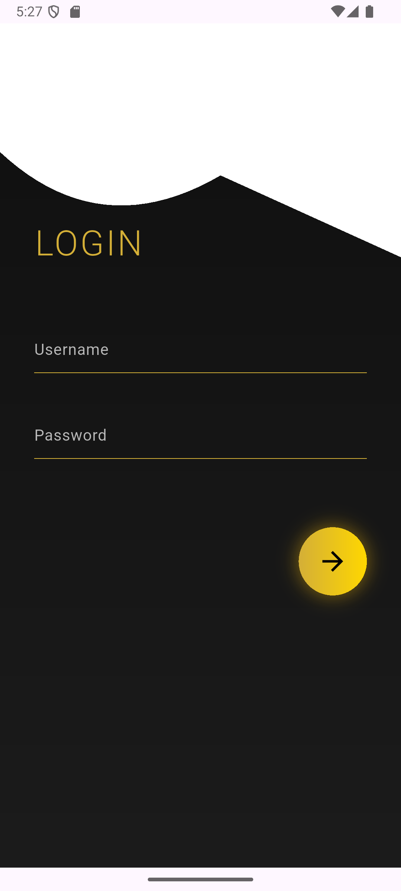
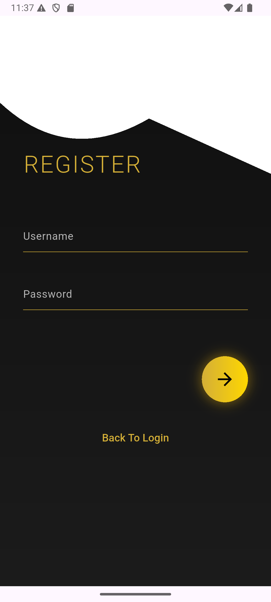
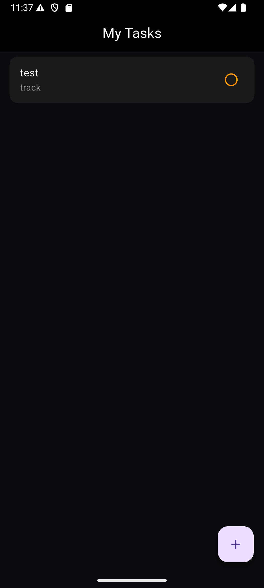
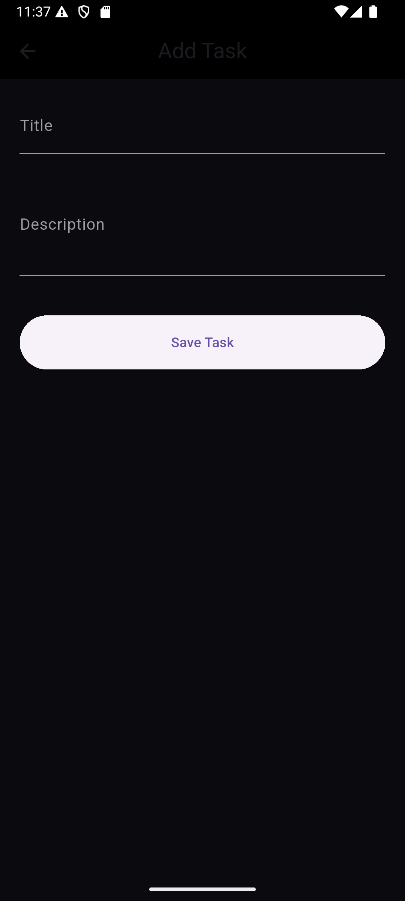
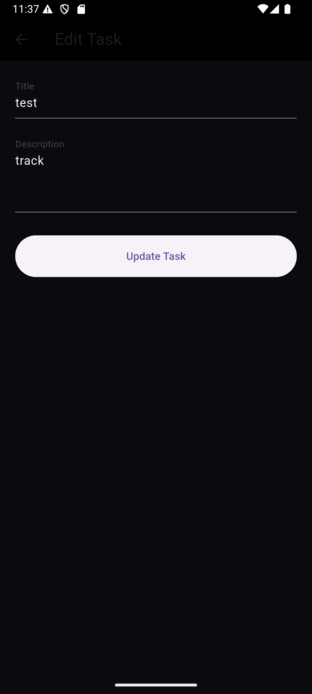
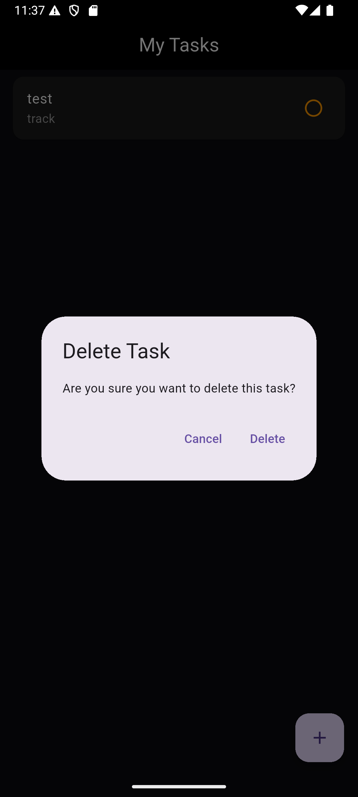

# Task Manager App

A full-stack Task Manager application built with **Flutter** and **Spring Boot** that allows users to securely manage their personal tasks using JWT Authentication.

---

## Features

* User Registration
* User Login with JWT Authentication
* Secure User-Specific Tasks
* Create Tasks
* Edit Tasks
* Delete Tasks
* Persistent Login using SharedPreferences
* MySQL Database Integration
* REST API Integration
* Railway Deployment

---

## Tech Stack

### Frontend

* Flutter
* Dart
* HTTP Package
* SharedPreferences

### Backend

* Spring Boot
* Spring Security
* JWT Authentication
* JPA / Hibernate
* MySQL

### Deployment

* Railway

---

## Project Structure

```text
lib/
├── login_screen.dart
├── register_screen.dart
├── splash_screen.dart
├── task_screen.dart
├── add_task_screen.dart
└── edit_task_screen.dart
```

---

## API Endpoints

### Authentication

```http
POST /api/auth/register
POST /api/auth/login
```

### Tasks

```http
GET    /api/tasks
POST   /api/tasks
PUT    /api/tasks/{id}
DELETE /api/tasks/{id}
```

---

## Application Screenshots

### Login Screen



### Register Screen



### Task List Screen



### Home Screen


### Add Task Screen



### Edit Task Screen



### Delete Task


---

## Security

* JWT Authentication
* User-Specific Task Access
* Protected REST Endpoints
* Secure Password Encryption with Spring Security

---

## Future Improvements

* Task Categories
* Task Priority
* Due Dates
* Search Tasks
* Dark / Light Theme
* Push Notifications

---

## Author

**Mustafa Salah**
